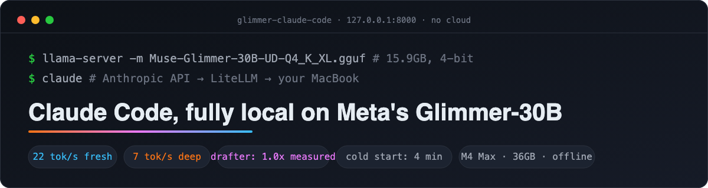
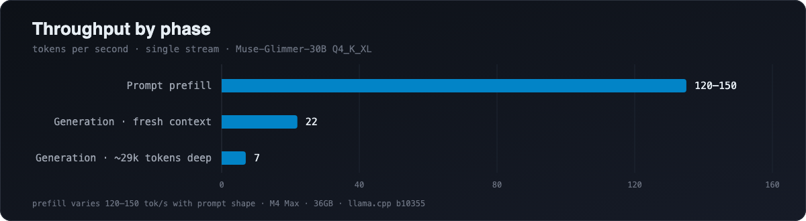
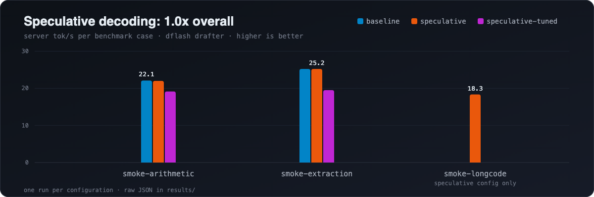
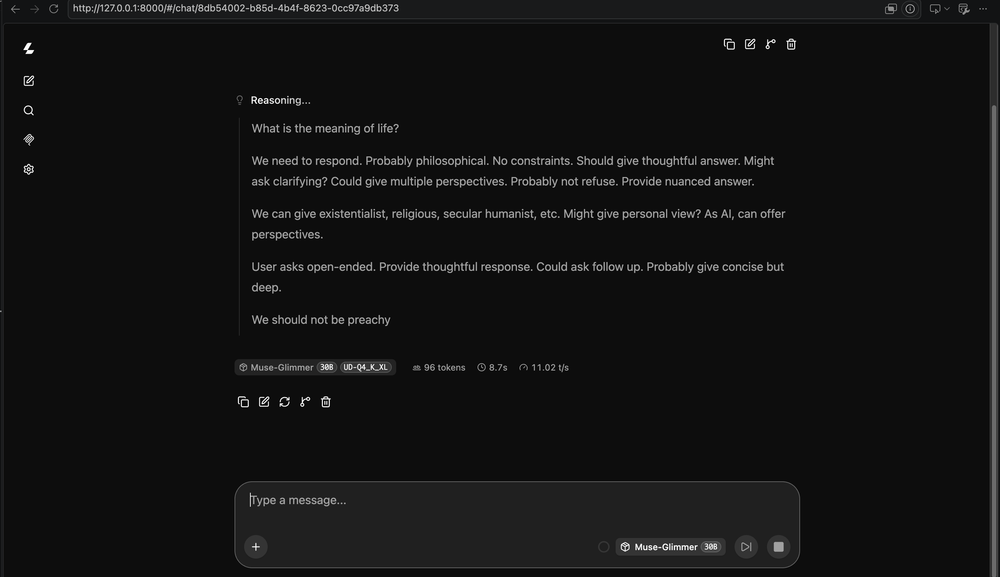
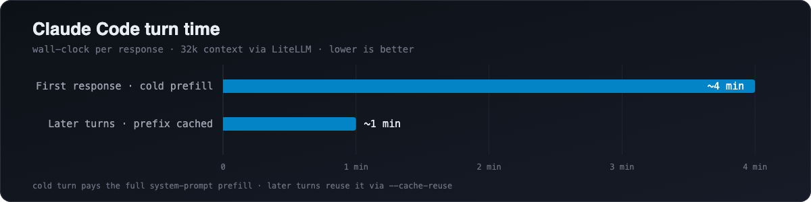

# Muse-Glimmer-30B: local inference with llama.cpp



## Introduction

This repository documents running Meta's Muse-Glimmer-30B entirely on a
MacBook Pro (M4 Max, 36GB, the hardware Meta benchmarked), testing their
performance claims, and connecting the model to Claude Code through LiteLLM
so a full coding agent runs with no cloud connection. Every command and every
number here was run and measured on that machine; raw benchmark output is in
`results/`.

In this project you will do the following:

- Build llama.cpp from source with day-one Glimmer support
- Download the 15.9GB 4-bit quant and Meta's dflash draft model
- Serve the model locally and benchmark it, with and without speculative decoding
- Run Claude Code against your own machine, fully offline

## Measured performance





| Scenario | Measured |
|---|---|
| Generation, fresh context | ~22 tok/s |
| Generation, ~29k tokens deep | ~7 tok/s |
| Prompt prefill | 120 to 150 tok/s |
| Speculative decoding (dflash) | 1.0x overall, bursts to ~20 tok/s in code |
| Claude Code first response (cold) | ~4 minutes |
| Claude Code later turns (cached) | ~1 minute |

Generation slows as context deepens, and prefill is paid on every cold
prompt. Agent harnesses carry large system prompts and operate deep in the
context window, so they experience the worst of both.

## DISCLAIMER

A point-in-time snapshot of day-one software, measured on one machine with a
small case set. Not affiliated with or endorsed by Meta or Anthropic. Verify
performance on your own hardware.

## 1. Install

```bash
brew uninstall llama.cpp
brew install --HEAD llama.cpp
brew install hf
```

Glimmer support merged into llama.cpp master on 2026-08-10 (PR #26841), so
the bottled release fails with `unknown model architecture: 'muse-glimmer'`
and the build must come from source. Verify with `llama-server --version`:
b10355 or higher.

## 2. Download the model

```bash
hf download unsloth/Muse-Glimmer-30B-GGUF Muse-Glimmer-30B-UD-Q4_K_XL.gguf --local-dir models/glimmer
hf download unsloth/Muse-Glimmer-30B-GGUF dflash-kquant.gguf --local-dir models/glimmer
```

The model (15.9GB, 4 bits per weight) and the draft model for speculative
decoding (1.5GB). Filenames are positional; `hf` silently ignores `--include`
with multiple patterns. Verify with `ls -lh models/glimmer/`.

## 3. Start the server

Standard:

```bash
llama-server -m models/glimmer/Muse-Glimmer-30B-UD-Q4_K_XL.gguf \
  --parallel 1 --cache-reuse 256 \
  --host 127.0.0.1 --port 8000 \
  -c 32768 -ngl 99 --jinja
```

With speculative decoding:

```bash
llama-server -m models/glimmer/Muse-Glimmer-30B-UD-Q4_K_XL.gguf \
  -md models/glimmer/dflash-kquant.gguf \
  --spec-type draft-dflash --spec-draft-n-max 16 -ngld 99 \
  --parallel 1 --cache-reuse 256 \
  --host 127.0.0.1 --port 8000 \
  -c 32768 -ngl 99 --jinja
```

Or `zsh start.sh` / `zsh start.sh plain`.

| Flag | Meaning |
|---|---|
| `-ngl 99` | all layers on GPU |
| `-c 32768` | 32k context |
| `--jinja` | model's chat template, required for tool calling |
| `--parallel 1` | one slot with the full context; the default 4 slots share one pool and large prompts fail |
| `--cache-reuse 256` | reuse cached prompt prefixes; essential for agents |
| `--spec-type draft-dflash` | enables speculation; defaults to `none`, without it the drafter loads but never runs |
| `--spec-draft-n-max 16` | tokens drafted per round (replaces `--draft-max`) |
| `-ngld 99` | draft model on GPU |

Loads in ~30s, runs in the foreground, stop with `Ctrl+C`. The startup
warning `[spec] failed to measure draft model memory` is harmless.

## 4. Verify

```bash
curl http://127.0.0.1:8000/health
```

`{"status":"ok"}` when ready. Then:

```bash
curl -s http://127.0.0.1:8000/v1/chat/completions -H "Content-Type: application/json" \
  -d '{"model":"glimmer","messages":[{"role":"user","content":"say hi"}],"max_tokens":500}'
```

Glimmer is a reasoning model: it thinks in `reasoning_content` before
answering in `content`, so use `max_tokens` of 500+ or the answer is empty.
Speculation is active only if `draft_n` appears in the response `timings`.

## 5. Benchmark

```bash
python3 bench/run_bench.py --target local --label <name>
```

## 6. Console



A local server is started with a UI for inference. YOu can access the UI on the following address. Go ahead and ask it something meaningful, like "What is the meaning of life?"

```
 http://127.0.0.1:8000.
```

Runs the cases in `bench/cases.json`, prints pass/fail and tok/s, writes JSON
to `results/`. Stdlib Python only; works with any OpenAI compatible server.

## 7. Claude Code

Claude Code speaks the Anthropic Messages API, llama-server speaks OpenAI;
LiteLLM bridges them. One-time setup (LiteLLM does not run on Python 3.14,
and new FastAPI breaks it, so both pins matter):

```bash
python3.13 -m venv .venv
.venv/bin/pip install "litellm[proxy]" "fastapi<0.116"
```

With llama-server running:

```bash
.venv/bin/litellm --config litellm-config.yaml --port 4000 --host 127.0.0.1
```

Then in a new terminal:

```bash
export ANTHROPIC_BASE_URL=http://127.0.0.1:4000
export ANTHROPIC_AUTH_TOKEN=local
export ANTHROPIC_MODEL=glimmer
export ANTHROPIC_DEFAULT_HAIKU_MODEL=glimmer
export API_TIMEOUT_MS=600000
export CLAUDE_CODE_MAX_CONTEXT_TOKENS=32768
claude
```

`ANTHROPIC_DEFAULT_HAIKU_MODEL` keeps background calls local.
`API_TIMEOUT_MS` stops the client timing out during the long first prefill.
`CLAUDE_CODE_MAX_CONTEXT_TOKENS` must match the server's `-c`; Claude Code
otherwise assumes 200k context and steers long sessions into the 32k limit.
The variables apply only to that terminal.

Expect the performance table above: ~4 minutes cold, ~1 minute per turn
after. Keep tasks small; every tool call is a round trip at local speed.



## Troubleshooting

All errors below were hit while building this project.

| Symptom | Cause | Fix |
|---|---|---|
| `command not found: pip` or `hf` | Hugging Face CLI not installed | `brew install hf` |
| `unknown model architecture: 'muse-glimmer'` | llama.cpp too old | step 1 (`--HEAD` build) |
| `failed to open GGUF ... No such file` | model not downloaded | step 2 |
| `"--draft-max": the argument has been removed` | renamed flag | use `--spec-draft-n-max` |
| speculative speed identical to baseline | drafter loaded but not enabled | add `--spec-type draft-dflash` |
| `curl: (7) Failed to connect` | server not running or still loading | start server; poll `/health` |
| empty `content` in response | reasoning model, small token budget | raise `max_tokens` |
| `Context size has been exceeded` | default 4 slots share one context pool | add `--parallel 1` |
| `ModuleNotFoundError: No module named 'proxy_server'` | LiteLLM on Python 3.14, or FastAPI too new | venv on 3.13, `pip install "fastapi<0.116"` |
| Claude Code: "will retry, check your network" | client timeout during cold prefill | `export API_TIMEOUT_MS=600000` |
| `ContextWindowExceededError` late in a session | client assumes 200k context, server has 32k | `export CLAUDE_CODE_MAX_CONTEXT_TOKENS=32768` |

## Repository structure

```
bench/cases.json      test cases
bench/targets.json    benchmark endpoints
bench/run_bench.py    benchmark runner
litellm-config.yaml   LiteLLM proxy config
start.sh              server launcher
results/              benchmark output (JSON)
assets/               banners, social cards, and result charts
```

## Contributing

Issues and pull requests welcome, particularly benchmark reproductions on
other Apple Silicon configurations and additions to the troubleshooting
table.

## License

Apache License 2.0. See [LICENSE](LICENSE).

---

Built and measured by Adam Milton-Barker, CogniTech Systems.
